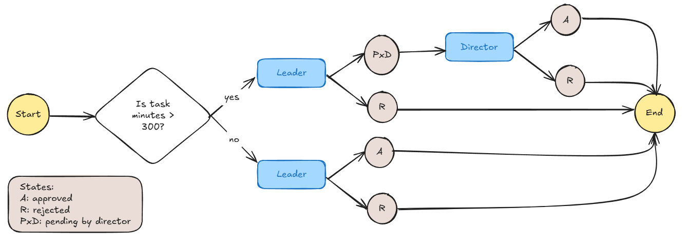

## Tabla de Contenidos

1. [Título y Descripción del Proyecto](#1-título-y-descripción-del-proyecto)
2. [Características](#2-características)
3. [Tecnologías Utilizadas](#3-tecnologías-utilizadas)
4. [Capturas de Pantalla y Demos](#4-capturas-de-pantalla-y-demos)

## 1. Título y Descripción del Proyecto

### Flujo de Aprobación

El proyecto está diseñado para gestionar aprobaciones de solicitudes a través de "workflows". Consiste en una lista de tareas que necesitan ser aprobadas o rechazadas. Los supervisores solo pueden aprobar tareas que tengan su nombre en la columna "Aprobador". La lógica de aprobación (workflow) se encuentra definida como una estructura JSON que contiene nodos y aristas, este asegura que solo el supervisor asignado pueda aprobar tareas.

El flujo de trabajo utilizado verifica la duración (en minutos) de la tarea, si la tarea dura más de 300 minutos la aprobación será secuencial (líder seguido de director), de lo contrario solo la aprobación del líder será requerida. La lógica del flujo de trabajo puede manejar escenarios más complejos, como múltiples aprobadores secuenciales o validación de IDs de aprobadores al adicionar más nodos a la estructura json.

## 2. Características

- Aprobar o rechazar solicitudes de los trabajadores definiendo una estructura del flujo de aprobación.
- Existen tres roles: Trabajador, Líder y Director
- Solo el rol "Trabajador" puede crear tareas que según la duración de la tarea serán aprobadas por los respectivos roles
- Una vez que la solicitud haya llegado a un estado final como "Approved" o "Rejected, no se podrá realizar acción alguna sobre la tarea debido al termino de su flujo.

## 3. Tecnologías Utilizadas

- **Next.js**: Un framework de React para la creación de aplicaciones web rápidas y escalables.
- **Prisma**: Un ORM (Object-Relational Mapping) para Node.js y TypeScript que facilita la interacción con la base de datos.
- **NextAuth.js**: Una solución de autenticación completa para Next.js.
- **Tailwind CSS**: Un framework de CSS para crear interfaces de usuario modernas y responsivas.
- **tRPC**: Una biblioteca para crear APIs de tipo seguro con TypeScript.
- **React**: Una biblioteca de JavaScript para construir interfaces de usuario.
- **TypeScript**: Un superconjunto de JavaScript que añade tipos estáticos y otras características avanzadas.

## 4. Capturas de Pantalla y Demos

| userName | contraseña | rol           |
|----------|------------|---------------|
| Rachel   | hello      | Líder         |
| John     | hello      | Trabajaddor   |
| Jamie    | hello      | Director      |

Entraremos con el usuario John que tiene el rol de "Trabajador" para crear tareas a ser aprobadas.
<video width="320" height="240" controls>
  <source src="public/readme/role-worker.mp4" type="video/mp4">
  Your browser does not support the video tag.
</video>

Ingresamos con el rol de "Líder" para aprobar las tareas tal como se muestra en la columna de "Approver":
Solo la tarea que tiene 400 minutos (mayor a los 300 minutos especificados en el workflow) requerirá una doble aprobación de líder seguido de director
<video width="320" height="240" controls>
  <source src="public/readme/role-leader.mp4" type="video/mp4">
  Your browser does not support the video tag.
</video>

Ingresamos con el rol de "Director" para aprobar las tareas (> 400 minutos) tal como se muestra en la columna de "Approver":
<video width="320" height="240" controls>
  <source src="public/readme/role-director.mp4" type="video/mp4">
  Your browser does not support the video tag.
</video>
