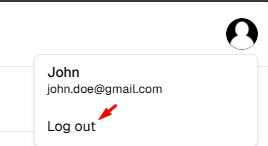
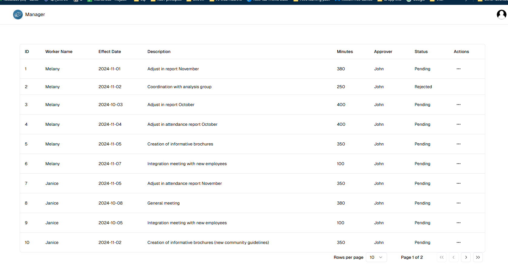
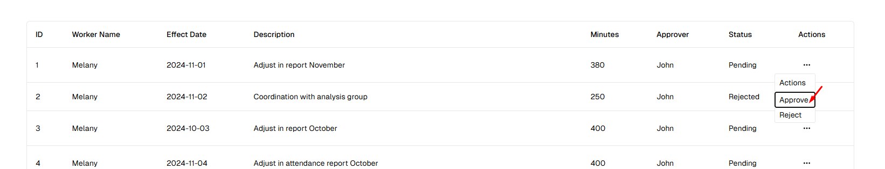
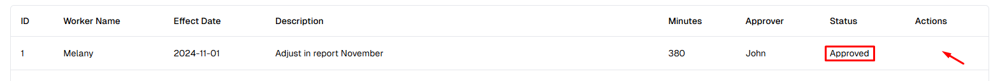

## Tabla de Contenidos

1. [Título y Descripción del Proyecto](#1-título-y-descripción-del-proyecto)
2. [Características](#2-características)
3. [Tecnologías Utilizadas](#3-tecnologías-utilizadas)
4. [Capturas de Pantalla y Demos](#4-capturas-de-pantalla-y-demos)

## 1. Título y Descripción del Proyecto

### Flujo de Aprobación

El proyecto está diseñado para gestionar aprobaciones de solicitudes a través de "workflows". Consiste en una lista de tareas que necesitan ser aprobadas o rechazadas. Los supervisores solo pueden aprobar tareas que tengan su nombre en la columna "Aprobador". La lógica de aprobación (workflow) se encuentra definida como una estructura JSON que contiene nodos y aristas, este asegura que solo el supervisor asignado pueda aprobar tareas y verifica si el supervisor está de vacaciones, impidiendo la aprobación hasta que esté activo nuevamente. La lógica del flujo de trabajo puede manejar escenarios más complejos, como múltiples aprobadores secuenciales o validación de IDs de aprobadores al adicionar más nodos a la estructura json.

## 2. Características

- Aprobar o rechazar solicitudes de los trabajadores definiendo una estructura del flujo de aprobación.
- Configurar la cantidad de aprobadores necesarios (edición del json en db).
- Aplicar diferentes validaciones a los aprobadores (edición del json en db).

## 3. Tecnologías Utilizadas

- **Next.js**: Un framework de React para la creación de aplicaciones web rápidas y escalables.
- **Prisma**: Un ORM (Object-Relational Mapping) para Node.js y TypeScript que facilita la interacción con la base de datos.
- **NextAuth.js**: Una solución de autenticación completa para Next.js.
- **Tailwind CSS**: Un framework de CSS para crear interfaces de usuario modernas y responsivas.
- **tRPC**: Una biblioteca para crear APIs de tipo seguro con TypeScript.
- **React**: Una biblioteca de JavaScript para construir interfaces de usuario.
- **TypeScript**: Un superconjunto de JavaScript que añade tipos estáticos y otras características avanzadas.

## 4. Capturas de Pantalla y Demos

Primero, inicie sesión con el siguiente usuario supervisor:
- **Usuario**: John
- **Contraseña**: password

Luego verá la lista de solicitudes para aprobar y también la información de la sesión con el botón de cierre de sesión.

Puede aprobar o rechazar la solicitud haciendo clic en la columna de acciones.

Una vez que una solicitud ha cambiado su estado, no puede cambiar su estado nuevamente.

